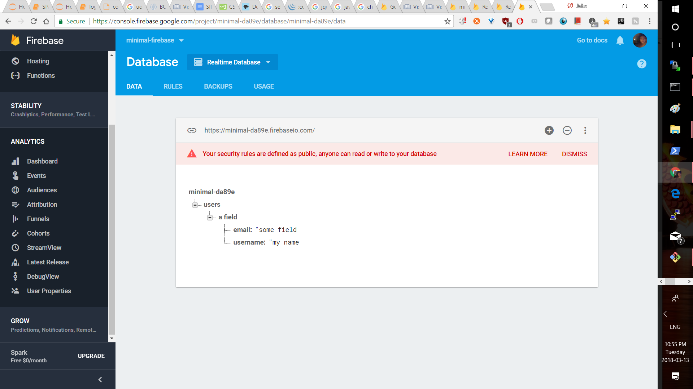

# minimal-firebase
minimal firebase (in the vein of minimal-angular)

one thing is: how do they prevent other people from using the same js snippet??

Hence: we can have a backend DB in firebase, and everything can be done "front end".

A: authentication, really tbh.

BTW: we tried adding the gitignore: if it does indeed work then we can avoid jetbrains workspace clobbering in the future.

AYY it is working, really is quite simple:

